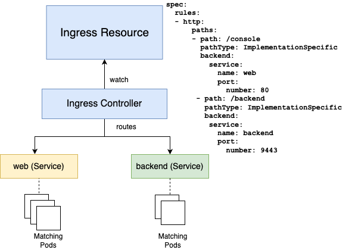

# Scalable networking with the Ingress resource

In this section, we examine a more robust Flyte deployment that makes use of an Ingress.

**If you're already familiar with the Kubernetes Ingress resource, skip to [the instructions](#Prerequisites)**

In [Part I](https://github.com/davidmirror-ops/flyte-the-hard-way/blob/main/docs/05-deploy-with-helm.md), we connected to the Flyte environment using a port-forward session. That’s convenient — but it’s not recommended for production environments for a couple of reasons:
- It’s temporary: Once your terminal closes, the session is closed
- It cannot be secured end-to-end by adding certificates or anything similar
 
The next piece in the Kubernetes hierarchy is the [Service](https://kubernetes.io/docs/concepts/services-networking/service/), which creates an abstraction on top of the particularities of Pod networking. However, Service resources also present some disadvantages, including:

- Service resources only provide basic traffic forwarding
- For public cloud/hosting environments, every Service resource will create a new Load Balancer instance, which quickly becomes cost-prohibitive and hard to manage

## Enter, the Ingress

   
*A reference diagram for an Ingress setup where the declarative config is defined by the Ingress resource and fulfilled by the controller*

A single Kubernetes Ingress resource will provide application-level routing for one or multiple backend Services, making it more efficient, scalable and robust than standalone Services.

Nevertheless, Ingress is one of the resources in Kubernetes that’s left to the operator to decide how to implement. It’s not enough to create an Ingress resource. You must also deploy an Ingress Controller (control plane) to translate the declarative configuration into routing paths to corresponding Services and Endpoints.
Learn more about Ingress [here](https://kubernetes.io/docs/concepts/services-networking/ingress/)

In this tutorial, you will set up Flyte to use the ALB controller, the preferred Ingress Controller for EKS environments.

## Setting up Amazon's Load Balancer (ALB) Ingress controller


### Prerequisites

1. An SSL certificate. It could be self-signed but for production environments, a CA-signed certificate is recommended
2. A domain name that's resolvable in your environment. In this guide we'll use `flyte-the-hard-way.uniondemo.run`. You should create your record in a DNS zone owned by you or your organization. If you use Route 53, [see the instructions](#Connecting-to-Flyte-through-Ingress) to create a record that points to your newly-created Ingress FQDN. 
3. Make sure you're using the most recent charts:
```bash
    $ helm repo update flyteorg
    Hang tight while we grab the latest from your chart repositories...
    ...Successfully got an update from the "flyteorg" chart repository
    Update Complete. ⎈Happy Helming!⎈
```
### Configuration

1. Unless you used `eksctl` or any other CloudFormation stack to create your VPC, you must manually tag your VPC subnets following the criteria below:

| Subnet type  | Tag key  | Value  |
|---|---|---|
| Private  |  `kubernetes.io/role/internal-elb` |  `1` | 
| Public  |  `kubernetes.io/role/elb` |  `1` | 

[Learn more about ALB Ingress requirements](https://docs.aws.amazon.com/eks/latest/userguide/alb-ingress.html)

> Similar to what was needed for Pods, the ALB controller will require a Service Account associated with an IAM Role and a Policy (see [Lab 3 for further reference](https://github.com/davidmirror-ops/flyte-the-hard-way/blob/main/docs/03-roles-service-accounts.md)). 

2. Download the policy JSON file:

```bash
curl -O https://raw.githubusercontent.com/kubernetes-sigs/aws-load-balancer-controller/v2.4.7/docs/install/iam_policy.json
```

3. Create a new IAM policy:

```bash
aws iam create-policy --policy-name fthw-alb-controller-policy --policy-document file://iam_policy.json
```
**Note**: you can change the `policy-name` to something different according to your organization's DevOps policies.

If the process is successful, you'll receive an output like the following:

**Take note of the ARN value**

```bash
{
    "Policy": {
        "PolicyName": "fthw-alb-controller-policy",
        "PolicyId": "ANPAYS5I3UDGH74E5ZKGW",
        "Arn": "arn:aws:iam::<AWS-account-ID>:policy/fthw-alb-controller-policy",
        "Path": "/",
        "DefaultVersionId": "v1",
        "AttachmentCount": 0,
        "PermissionsBoundaryUsageCount": 0,
        "IsAttachable": true,
        "CreateDate": "2023-05-03T19:55:10+00:00",
        "UpdateDate": "2023-05-03T19:55:10+00:00"
    }
}
```


4. Complete the sequence by creating an IAM role and a new Kubernetes service account under the `kube-system` namespace, annotated to include the ARN of the IAM role:

```bash
eksctl create iamserviceaccount \
  --cluster=<EKS-CLUSTER-NAME> \
  --namespace=kube-system \
  --name=aws-load-balancer-controller \
  --role-name <ALB-ROLE-NAME> \
  --attach-policy-arn=arn:aws:iam::<AWS-account-ID>:policy/fthw-alb-controller-policy \
  --approve
```
5. Verify that the IAM role is created and associated with the proper service account and OIDC providers:

```bash
aws iam get-role --role-name <ALB-ROLE-NAME> --query Role.AssumeRolePolicyDocument
```
Example output:
```bash
{
    "Version": "2012-10-17",
    "Statement": [
        {
            "Effect": "Allow",
            "Principal": {
                "Federated": "arn:aws:iam::<AWS_ACCOUNT_ID>:oidc-provider/oidc.eks.us-east-1.amazonaws.com/id/0B39DA22D7DF1B9569260EEFE1926663"
            },
            "Action": "sts:AssumeRoleWithWebIdentity",
            "Condition": {
                "StringEquals": {
                    "oidc.eks.us-east-1.amazonaws.com/id/0B39DA22D7DF1B9569260EEFE1926663:sub": "system:serviceaccount:kube-system:aws-load-balancer-controller",
                    "oidc.eks.us-east-1.amazonaws.com/id/0B39DA22D7DF1B9569260EEFE1926663:aud": "sts.amazonaws.com"
                }
            }
        }
    ]
}
```
6. Verify the service account is annotated with the IAM role ARN:

```bash
$ kubectl describe sa aws-load-balancer-controller -n kube-system
```
Example output:
```bash
Name:                aws-load-balancer-controller
Namespace:           kube-system
Labels:              app.kubernetes.io/managed-by=eksctl
Annotations:         eks.amazonaws.com/role-arn: arn:aws:iam::<AWS_ACCOUNT_ID>:role/fthw-alb-controller-role
Image pull secrets:  <none>
Mountable secrets:   <none>
Tokens:              <none>
Events:              <none>
```

## Installing the ALB controller

7. Add the EKS Helm repo:
```bash
helm repo add eks https://aws.github.io/eks-charts

```
8. Make sure you're using the most recent charts:
```bash
helm repo update eks
```
9. Install the ALB controller:

```bash
helm install aws-load-balancer-controller eks/aws-load-balancer-controller \
  -n kube-system \
  --set clusterName=<EKS-CLUSTER-NAME> \
  --set serviceAccount.create=false \
  --set serviceAccount.name=aws-load-balancer-controller 
```
Example output:
```bash
NAME: aws-load-balancer-controller
LAST DEPLOYED: Wed May  3 15:26:21 2023
NAMESPACE: kube-system
STATUS: deployed
REVISION: 1
TEST SUITE: None
NOTES:
AWS Load Balancer controller installed!
```

10. Verify the controller is installed:

```bash
kubectl get deployment -n kube-system aws-load-balancer-controller
```
Example output:

```bash
NAME                           READY   UP-TO-DATE   AVAILABLE   AGE
aws-load-balancer-controller   2/2     2            2           52s
```
____
Next: [Configure SSL](07-configure-SSL.md)
