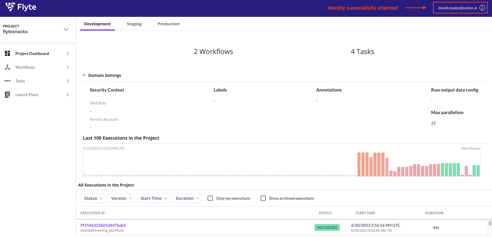

# Upgrade your Helm release to use auth

In this guide, you'll use two sections of the Helm chart to insert the auth configuration for your Flyte deployment

1. Take the `Client Secret` generated by Okta for the `flytepropeller` App Integration and generate a hash using the following command:

```bash
pip install bcrypt && python -c 'import bcrypt; import base64; print(base64.b64encode(bcrypt.hashpw("<flytepropeller-client-secret>".encode("utf-8"), bcrypt.gensalt(6))))'
```

Example output:
```bash
b'JDJiJDA2JG9NbzR3akFJU0daaXBkazJ5R0ZYLk9jWXpCa0lnWDlyY1RaSjdoYzRYUWtJbFFhZTdwbVdD'
```
You will use the output without the `b''` characters.

2. Go to the `auth` section of the `eks-production.yaml` values files and replace accordingly:

```yaml
  auth:
    enabled: true
    oidc:
      # Typically, it looks similar to https://dev-39924781.okta.com/oauth2/aus9xyo1dg41VrOU65d7
      baseUrl: <your auth-server-issuer-URI> 
      # Use the parameters from the flyteconsole app integration
      clientId: <flyteconsole-client-id>
      clientSecret: <flyteconsole-client-secret>
    # Even using external auth server, the internal settings are needed for flyteadmin <> flytepropeller communication 
    internal:
      clientId: <flytepropeller-clientID>
      clientSecret: '<flytepropeller-client-secret>' #dont't remove the quotes
      clientSecretHash: <flytepropeller-clientSecret-hash> # the one you generated in step 1
    authorizedUris:
    - <your-Ingress-domain-name> # example https://flyte-the-hard-way.uniondemo.run
```

3. For the remainder of the configuration, you'll leverage the `inline` section of the values file. The spec that you put under this section will be merged with the base config:

```yaml
inline:
    auth:
      appAuth:
        authServerType: External
        externalAuthServer:
          baseUrl: <your-Issuer-URI> #example https://dev-39924781.okta.com/oauth2/aus9xyo1dg41VrOU65d7
          metadataUrl: .well-known/oauth-authorization-server
        thirdPartyConfig:
          flyteClient:
            clientId: <flytectl Client ID>
            redirectUri: http://localhost:53593/callback
            scopes:
            - offline
            - all
      userAuth:
          openId:
          baseUrl: <your-Issuer-URI> 
          scopes:
          - profile
          - openid
          # Insert flyteconsole clientId generated by Okta
          clientId: <flyteconsole-Client-ID> 
    secrets: 
      adminOauthClientCredentials:
        enabled: true
        clientSecret: <flytepropeller-Client-Secret>
        clientId: <flytepropeller-Client-ID>

```

4. Upgrade your Helm release with the updated values file:

```bash

helm upgrade flyte-backend flyteorg/flyte-binary -n flyte --values eks-production.yaml
```
Example output:

```bash
Release "flyte-backend" has been upgraded. Happy Helming!
NAME: flyte-backend
LAST DEPLOYED: Tue Jun 20 10:01:24 2023
NAMESPACE: flyte
STATUS: deployed
REVISION: 11
TEST SUITE: None
```

5. Wait a couple of minutes while Helm terminates the old Flyte pod and updates resources. Then, check out the status of the Flyte pod:

```bash
kubectl get po -n flyte
```
Example output:

```bash
NAME                                          READY   STATUS    RESTARTS   AGE
flyte-backend-flyte-binary-5b9455788f-rskl9   1/1     Running   0          4d20h
```
6. From this point on, when you go to the Flyte console or when you run commands like `pyflyte run` you should be redirected to Okta for login and authorization.

For example, a workflow execution from the command line will be redirected to obtain a token from Okta

```bash
pyflyte run --remote example.py training_workflow \                                          --hyperparameters '{"C": 0.1}'

127.0.0.1 - - [20/Jun/2023 09:56:50] "GET /callback?code=YyK7HRnt7_phXybUf7m2p5Z7pwd4Bt1yCqzEx0YcW9c&state=orsqRSjiRkr7wGHIdVq7Gc1xfHvYQUsstL4YwBI7R525gtLN5RQ0xA HTTP/1.1" 200 -

Go to https://flyte-the-hard-way.uniondemo.run/console/projects/flytesnacks/domains/development/executions/f91546323601d447bab3 to see execution in the console.
``` 

**Flyte console**:

