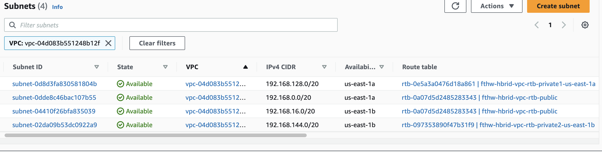

# Deploying an EKS cluster

> Before proceeding, it's recommended to check your organization's preferred networking and security settings for EKS clusters. Flyte doesn't require anything beyond what the Kubernetes nodes require to operate::
> - Connection to the EKS control plane (also called `API Server`)

In this tutorial we make use of the following configuration:

- API server endpoint access: `Public` and `Private`
- Node group using public subnets
- VPC already configured with both Public and Private subnets
- Public subnets enabled to Auto-assign public IPV4 address

[Learn more about EKS networking](https://aws.amazon.com/blogs/containers/de-mystifying-cluster-networking-for-amazon-eks-worker-nodes/)
____
1. Make sure that your system has the following components installed:
- [kubectl](https://docs.aws.amazon.com/eks/latest/userguide/install-kubectl.html)
- [eksctl](https://docs.aws.amazon.com/eks/latest/userguide/eksctl.html)
- [awscli](https://docs.aws.amazon.com/cli/latest/userguide/getting-started-install.html)
- [Helm](https://helm.sh/docs/intro/install/) 
- openssl
- Access to the AWS console

2. If you haven't done it previously, complete the awscli [quick configuration](https://docs.aws.amazon.com/cli/latest/userguide/cli-configure-quickstart.html#cli-configure-quickstart-config)
3. Go to the AWS Management console > **Virtual Private Cloud** > **Subnets** and take note of both the Public and Private subnet IDs available in the supported Availability Zones on the VPC you plan to use to deploy Flyte:



4. Go to the terminal and submit the command to create the EKS control plane, following these recommendations:
- Pick a Kubernetes version >= 1.19
- Give the cluster an informative name (eg. flyte-eks-cluster)


```bash
eksctl create cluster --name my-cluster --region region-code  --version 1.25 --vpc-private-subnets private-subnet-ID1,private-subnet-ID2 --vpc-public-subnets public-subnetID1,public-subnetID2 --without-nodegroup
```

After a few minutes, the deployment should finish with an output similar to:

```bash
EKS cluster "my-cluster" in "region-code" region is ready
```
5. From the **AWS Management Console** go to **EKS**
6. Click on your cluster name and select the **Networking** tab
7. Click on **Manage networking**
8. Select **Public and private** as the **Cluster endpoint access** mode and **Save changes**
## Create an EKS node group
In this step we'll deploy the Kubernetes worker nodes where the actual workloads will run.

1. From the AWS Management console, go to **EKS**
2. Select the cluster you created in the previous section
3. Go to **Compute** and click on **Add node group**
4. Assign a name to the node group
5. In the **Node IAM role** menu, select the `<eks-node-role>` created in the Roles and Service accounts section
6. For learning purposes, do not use launch templates, labels or taints
7. Choose the default `Amazon Linux 2 (AL2_x86_x64)` **AMI type**
8. Use `On-demand` **Capacity type** 
9. Instance type and size can be chosen based on your devops requirements. 

>NOTE: Previous testing suggests that `t3.xlarge` provides the required resources to run the example workflows referenced in this tutorial.

10. Keep all other options by default.
13. Review the configuration and click **Create**

Learn more about [AWS managed node groups](https://docs.aws.amazon.com/eks/latest/userguide/managed-node-groups.html)

Within a CDK stack:

```ts
const eksClusterNodeGroupRole = new Role(this, 'eksClusterNodeGroupRole', {
  assumedBy: new ServicePrincipal('ec2.amazonaws.com'),
  managedPolicies: [
    ManagedPolicy.fromAwsManagedPolicyName('AmazonEKSWorkerNodePolicy'),
    ManagedPolicy.fromAwsManagedPolicyName('AmazonEC2ContainerRegistryReadOnly'),
    ManagedPolicy.fromAwsManagedPolicyName('AmazonEKS_CNI_Policy'),
  ],
});

const kubernetesVersion = KubernetesVersion.V1_31;
const kubectlLayer = new KubectlV31Layer(this, 'kubectl');
this.cluster = new Cluster(this, 'flyte-eks-cluster', {
  // if you do not specify a VPC or control plane security group, they will be created on your behalf with the correct tags
  defaultCapacity: 0, // start with 0 capacity
  version: kubernetesVersion,
  kubectlLayer: kubectlLayer, // Lambda function responsible to issuing kubectl and helm commands against the cluster
  ipFamily: IpFamily.IP_V4,
  endpointAccess: EndpointAccess.PUBLIC_AND_PRIVATE,
});

this.cluster.addNodegroupCapacity('custom-node-group', {
  nodegroupName: 'default-managed',
  minSize: 2,
  amiType: NodegroupAmiType.AL2_X86_64,
  instanceTypes: [new InstanceType('t3.xlarge')],
  nodeRole: eksClusterNodeGroupRole,
  capacityType: CapacityType.ON_DEMAND,
});
```

## Connecting to the EKS cluster

Now, you have to “let your terminal know” where’s the Kubernetes cluster you’re trying to connect to.

Use your AWS account access keys to run the following commands, updating the `kubectl` config and switching to the new EKS cluster context:

14. Store your AWS login information in environment variables so they can be grabbed by `awscli`:
```bash
export AWS_ACCESS_KEY_ID=<YOUR-AWS-ACCOUNT-ACCESS-KEY-ID>
export AWS_SECRET_ACCESS_KEY=<YOUR-AWS-SECRET-ACCESS-KEY>
export AWS_SESSION_TOKEN=<YOUR-AWS-SESSION-TOKEN>
```
15. Switch to the new EKS cluster’s context:

```bash
aws eks update-kubeconfig --name <my-cluster> --region <region>
```

16. Verify the context has switched:
```bash
$ kubectl config current-context
arn:aws:eks:<region>:<AWS_ACCOUNT_ID>:cluster/<Name-EKS-Cluster>
```
17. Verify there are no Pod resources created (this step also validates connectivity to the EKS API Server)
```bash
$ kubectl get pods
No resources found in default namespace.
```

## Create an S3 bucket

This is the blob storage resource that will be used by FlytePropeller and DataCatalog to store metadata for versioning and other use cases.

18. From the AWS Management Console, go to **S3**
19. Create a bucket leaving **Block all public access** enabled
20. Choose the same region and VPC as your EKS cluster
21. Take note of the name as it will be used in your Helm `values` file

```ts
const dataBucket = new Bucket(this, 'DataBucket', {
  blockPublicAccess: BlockPublicAccess.BLOCK_ALL,
  versioned: true,
  encryption: BucketEncryption.S3_MANAGED,
  enforceSSL: true,
});
```

---
Next: [Configure roles and service accounts](03-roles-service-accounts.md)
