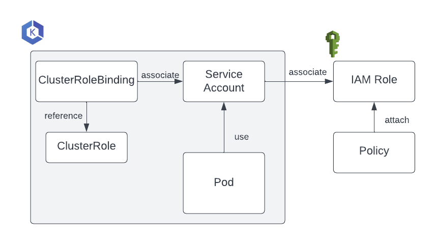

# Configure roles and service accounts

In order to restrict what Flyte components are entitled to do in an AWS environment, this guide leverages the integration between Kubernetes Service Accounts and IAM Roles. In this way, Flyte’s control plane components and data plane Pods (where the actual workflows run) will use Kubernetes service accounts associated with a set of permissions defined in the IAM Role. Any changes in the scope of permissions or policies in the IAM Role, will be inherited by the Kubernetes resources providing centralized control over Authorization:



## Configure an OIDC provider for the EKS cluster

1. Verify that an OIDC issuer was created as part of the EKS deployment process:

```bash
aws eks describe-cluster --region <region> --name <Name-EKS-Cluster> --query "cluster.identity.oidc.issuer" --output text
```
2. Create the OIDC provider that will be associated with the EKS cluster:
```bash
eksctl utils associate-iam-oidc-provider --cluster <Name-EKS-Cluster> --approve
```
3. From the AWS Management Console, verify that the OIDC provider has been created by going to **IAM** and then **Identity providers**. There should be a new provider entry has with the same <UUID-OIDC> issuer as the cluster’s.

## Create a user-managed IAM policy

In order to restrict the permissions enabled for Flyte (both the backend and the worker Pods) you will create a custom IAM Policy.

1. Create a `flyte-IAM-policy.json` file with the following contents, inserting the name of your S3 bucket where indicated:


```json
{
    "Version": "2012-10-17",
    "Statement": [
        {
            "Effect": "Allow",
            "Action": [
                "s3:DeleteObject*",
                "s3:GetObject*",
                "s3:ListBucket",
                "s3:PutObject*"
            ],
            "Resource": [
                "arn:aws:s3:::<your-S3-bucket>", 
                "arn:aws:s3:::<your-S3-bucket>/*"
            ]
        }
    ]
}
```

2. Create the IAM policy:

```bash
aws iam create-policy --policy-name flyte-custom-policy  --policy-document file://flyte-IAM-policy.json
```

Example output:

```bash
{
    "Policy": {
        "PolicyName": "fthw-test-2",
        "PolicyId": "ANPAYS5I3UDGHFR7TZ4CD",
        "Arn": "arn:aws:iam::<AWS-ACCOUNT>:policy/<policy-name>",
        "Path": "/",
        "DefaultVersionId": "v1",
        "AttachmentCount": 0,
        "PermissionsBoundaryUsageCount": 0,
        "IsAttachable": true,
        "CreateDate": "2023-11-30T17:32:17+00:00",
        "UpdateDate": "2023-11-30T17:32:17+00:00"
    }
}
(END)
```
3. Take note of the policy ARN.

## Create IAM Roles
1. Create the `flyte-system-role` IAM role that the backend components will use. You won't create a Kubernetes service account at this point; it will be created by running the Helm chart at the end of the process:

```bash
eksctl create iamserviceaccount --cluster=<Name-EKS-Cluster> --name=flyte-backend-flyte-binary --role-only --role-name=flyte-system-role --attach-policy-arn arn:aws:iam::<AWS-ACCOUNT>:policy/<policy-name> --approve --region <region-code> --namespace flyte
```

2. Verify that the trust relationship between the IAM role and the OIDC provider has been created correctly:

```bash
aws iam get-role --role-name flyte-system-role --query Role.AssumeRolePolicyDocument
```
Example output:
```yaml
{
    "Version": "2012-10-17",
    "Statement": [
        {
            "Effect": "Allow",
            "Principal": {
                "Federated": "arn:aws:iam::<AWS-ACCOUNT>:oidc-provider/oidc.eks.<region-code>.amazonaws.com/id/<UUID-OIDC>"
            },
            "Action": "sts:AssumeRoleWithWebIdentity",
            "Condition": {
                "StringEquals": {
                    "oidc.eks.us-east-1.amazonaws.com/id/<UUID-OIDC>:sub": "system:serviceaccount:flyte:flyte-backend-flyte-binary",
                    "oidc.eks.<region-code>.amazonaws.com/id/<UUID-OIDC>:aud": "sts.amazonaws.com"
                }
            }
        }
    ]
}
```
3. Create the role that the Task Pods will use to consume AWS resources:
```bash
eksctl create iamserviceaccount --cluster=<Name-EKS-Cluster> --name=default --role-only --role-name=flyte-workers-role --attach-policy-arn arn:aws:iam::<AWS-ACCOUNT>:policy/<policy-name> --approve --region <region-code> --namespace flyte
```
>NOTE: as this role will be used by the `default` Service Account on each `project-domain` namespace, you'll need to adjust the Role definition to make it work for any namespace:

4. Go to the **AWS Management Console** > **IAM** > **Roles**
5. Find your `flyte-workers-role` Role and go to the **Trust relationships** view
6. Click **Edit Trust Policy**
7. You should have something like this:

```json
"Version": "2012-10-17",
	"Statement": [
		{
			"Effect": "Allow",
			"Principal": {
				"Federated": "arn:aws:iam::<AWS-ACCOUNT>:oidc-provider/oidc.eks.<AWS-REGION>.amazonaws.com/id/<UUID-OIDC>"
			},
			"Action": "sts:AssumeRoleWithWebIdentity",
			"Condition": {
				"StringEquals": {
					"oidc.eks.<AWS-REGION>.amazonaws.com/id/<UUID-OIDC>:aud": "sts.amazonaws.com",
					"oidc.eks.us-east-1.amazonaws.com/id/<UUID-OIDC>:sub": "system:serviceaccount:flyte:default"
				}
			}
		}
```

8. You'll want to switch from the `StringEquals` condition operator to `StringLike` in order to enable the use of a wildcard in the namespace position:

```json
"Version": "2012-10-17",
	"Statement": [
		{
			"Effect": "Allow",
			"Principal": {
				"Federated": "arn:aws:iam::<AWS-ACCOUNT>:oidc-provider/oidc.eks.<AWS-REGION>.amazonaws.com/id/66CBAF563FD1438BC98F1EF39FF8DACD"
			},
			"Action": "sts:AssumeRoleWithWebIdentity",
			"Condition": {
				"StringLike": {
					"oidc.eks.<AWS-REGION>.amazonaws.com/id/66CBAF563FD1438BC98F1EF39FF8DACD:aud": "sts.amazonaws.com",
					"oidc.eks.us-east-1.amazonaws.com/id/66CBAF563FD1438BC98F1EF39FF8DACD:sub": "system:serviceaccount:*:default"
				}
			}
```	

9. Save your changes
---
Next: [Create a relational database](04-create-database.md)

## Draft CDK

CDK to create a service account with access to AWS resources.
This service account below operates on `kube-system` namespace.
The method [creates a new role](https://github.com/aws/aws-cdk/blob/main/packages/aws-cdk-lib/aws-eks/lib/service-account.ts#L194) with an [OIDC Principal](https://github.com/aws/aws-cdk/blob/main/packages/aws-cdk-lib/aws-eks/lib/service-account.ts#L177)

Currently, I let flyte create the service account for `flyte-binary`.

```ts
// provide Kubernetes Pods access to AWS resources
// kubectlRoleArn https://github.com/aws/aws-cdk/tree/main/packages/aws-cdk-lib/aws-eks#service-accounts
const serviceAccountManifest = cluster.addServiceAccount('eks-admin-service-account', {
  name: 'eks-admin',
  namespace: 'kube-system',
});

const clusterRoleBindingManifest = cluster.addManifest('eks-admin-cluster-role-binding', {
  apiVersion: 'rbac.authorization.k8s.io/v1', // native Kubernetes Role Based Access Control (RBAC)
  kind: 'ClusterRoleBinding',
  metadata: {
    name: 'eks-admin',
  },
  roleRef: {
    apiGroup: 'rbac.authorization.k8s.io',
    kind: 'ClusterRole',
    name: 'cluster-admin',
  },
  subjects: [
  {
    kind: 'ServiceAccount',
    name: 'eks-admin',
    namespace: 'kube-system',
  },
  ],
});

clusterRoleBindingManifest.node.addDependency(serviceAccountManifest);
```
