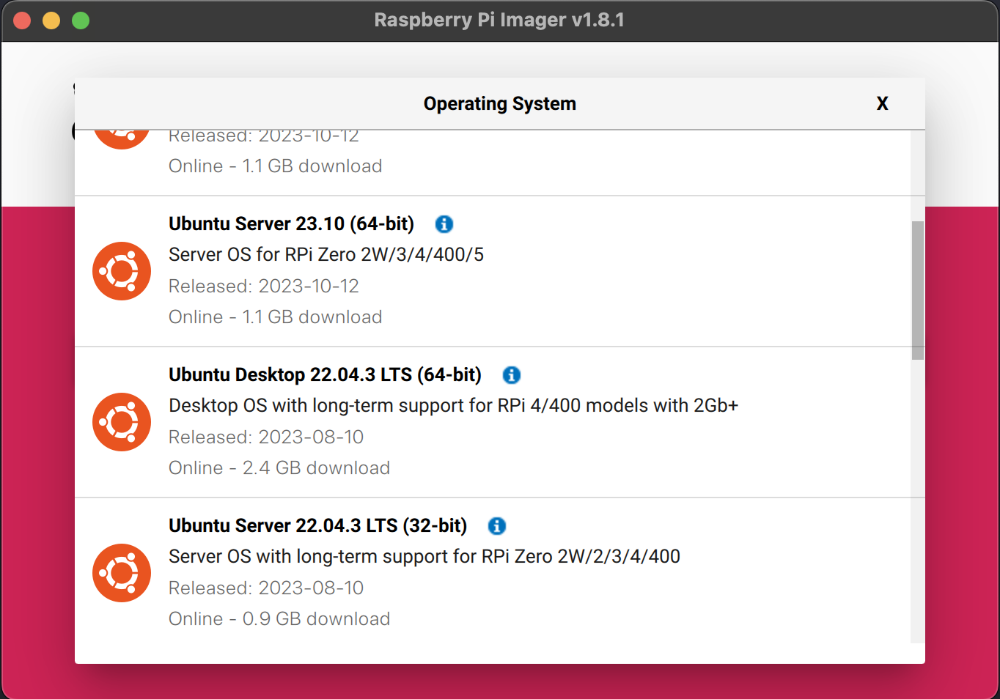

# Preparing the Raspberry Pi

Feel free to skip this section, if you already have a Ubuntu Server powered machine in your homelab. This section will be a brief walk through the process of preparing a Raspberry Pi before installing microk8s.

## Pre-requisites

### Hardware

- Raspberry Pi 4 Model B (8 GB RAM recommended)
- Raspberry Pi Power Supply & Ethernet Cable
- Micro SD Card & SD Card Reader

### Software

- The [Raspberry Pi Imager](https://www.raspberrypi.com/software/)

## Flash the Micro SD Card

- Download and run the Raspberry Pi Imager, choose your correct Raspberry Pi Device and select the Micro SD card that is connected to your machine
- For the Operating System use: `Other general-purpose OS > Ubuntu > Ubuntu Server 22.04.3 LTS (64-bit)`
- Flash it ⚡



## Prepare for MicroK8s

- SSH into your Raspberry Pi and enable c-groups so kubelet will work out of the box. To do so, configure the following configuration file:

```bash
sudo nano /boot/firmware/cmdline.txt
```

- Add the following options: `cgroup_enable=memory cgroup_memory=1`
- Save the file and reboot your Raspberry Pi
- For Ubuntu Server image versions 21.10+, it is necessary to install to install extra kernel modules

```bash
sudo apt-get update
sudo apt install linux-modules-extra-raspi
```

- Restart your Raspberry Pi once again

---

Next: [install and configure microk8s](02-install-configure-microk8s.md)
