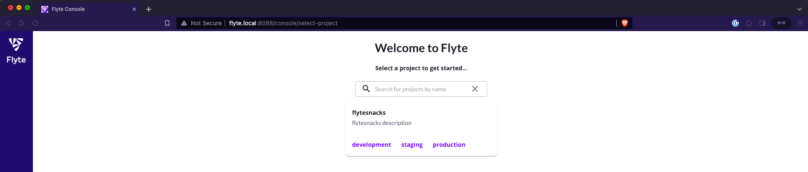

# Install Flyte
To make sure your future Flyte deployment can access Kubernetes services via internal DNS, make sure to enable the DNS addon of microk8s:
``` bash
microk8s enable dns
```
Download the values file:
``` bash
curl -sl https://raw.githubusercontent.com/davidmirror-ops/flyte-the-hard-way/main/docs/on-premises/microk8s/local-values.yaml > local-values.yaml.yaml
```
> Make sure to adjust the values for the minio & postgres deployment you just submitted

Install the Flyte binary via Helm:
``` bash
microk8s.helm repo add flyteorg https://flyteorg.github.io/flyte
microk8s.helm upgrade flyte-binary flyteorg/flyte-binary --values local-values.yaml --install -n flyte
```
After waiting for a couple of seconds you should see a flyte-binary pod in the flyte namespace:
```bash
NAME                            READY   STATUS    RESTARTS   AGE
postgres-6f6bb8bff7-9sjnj       1/1     Running   0          75s
minio-7d795cd5d8-dlk54          1/1     Running   0          75s
flyte-binary-7cdc7c66b7-wngw4   1/1     Running   0          17m
```
Using kubernetes port forwarding we can already validate our flyte deployment:
```bash
kubectl -n flyte port-forward service/flyte-binary-http 8088:8088 --address 0.0.0.0
```
To access the Flyte UI, configure a local DNS entry on your development device in your local network. In an OSX environment, adjust the `/etc/hosts` file:

```bash
127.0.0.1       localhost
255.255.255.255 broadcasthost
::1             localhost
# Add a new entry like this
your-ubuntu-server-local-ip flyte.local
```
Access the Flyte UI using the configured DNS entry & forwarded port:


---
**Congratulations!**

You have a healthy Flyte deployment in your local network. Submitting workflows from your development device is still another story. Follow the next section where we will add ingress and tls to the Flyte deployment. 

---
Next: [add ingress and tls](05-add-ingress-and-tls.md)