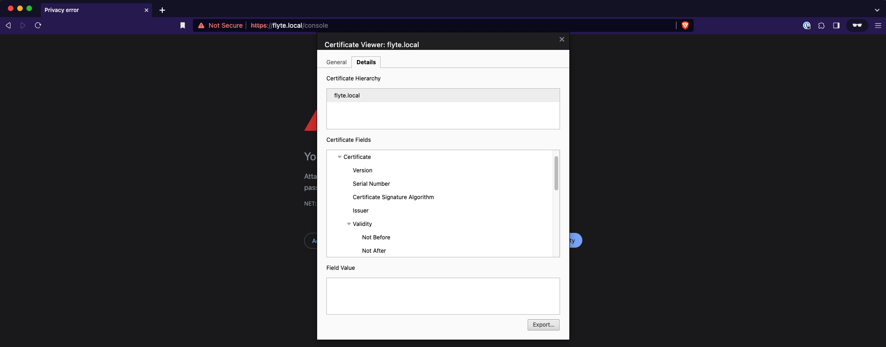
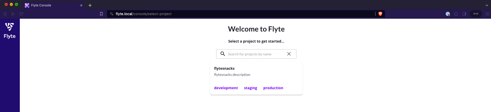

# Adding Ingress & TLS

This section will demonstrate how to add Ingress and TLS to your flyte deployment in order to access flyte from any device in your local network.

First of all, enable the Ingress microk8s addon:

```bash
microk8s enable ingress
```

> For simplicity reasons, this tutorial uses self-signed certificates to enable a TLS connection.
> Create a self signed certificate for the hostname `flyte.local` like this:

```bash
KEY_FILE=flyte.key
CERT_FILE=flyte.crt
CERT_NAME=flytetls
HOST=flyte.local
openssl req -x509 -nodes -days 365 -newkey rsa:2048 -keyout ${KEY_FILE} -out ${CERT_FILE} -subj "/CN=${HOST}/O=${HOST}" -addext "subjectAltName = DNS:${HOST}"
```

Given the certificate and key, create a Kubernetes secret in the `flyte` namespace:

```bash
kubectl create secret tls ${CERT_NAME} --key ${KEY_FILE} --cert ${CERT_FILE} -n flyte
```

To add Ingress and TLS to your Flyte deployment, add the following block to your Flyte binary Helm chart and update your deployment:

```yaml
ingress:
  create: true
  host: "{{ .Values.userSettings.hostName }}"
  separateGrpcIngress: true
  tls:
    - hosts:
        - "{{ .Values.userSettings.hostName }}"
      secretName: flytetls
  commonAnnotations:
    kubernetes.io/ingress.class: public
  httpAnnotations:
    nginx.ingress.kubernetes.io/app-root: /console
  grpcAnnotations:
    nginx.ingress.kubernetes.io/backend-protocol: GRPC
```

To validate your updated deployment, check the Ingress resources in the flyte namespace:

```bash
kubectl get ingress -n flyte
```

Example output:

```bash
NAME                CLASS    HOSTS         ADDRESS     PORTS     AGE
flyte-binary-grpc   <none>   flyte.local   127.0.0.1   80, 443   8m33s
flyte-binary-http   <none>   flyte.local   127.0.0.1   80, 443   8m33s
```

Accessing the Flyte UI from a development device in the local network will show a privacy error first, because the self signed certificate is not trusted yet:



Export this certificate on your development device, trust it and import it into your browser.

> On Mac OS simply import the certificate into your KeyChain Access App and trust the certificate. This way all browsers on your device can use this trusted certificate.


**Congratulations!**

Your successfully added ingress and tls to your Flyte deployment.

---

Next: [submitting workflows](06-submitting-workflows.md)
