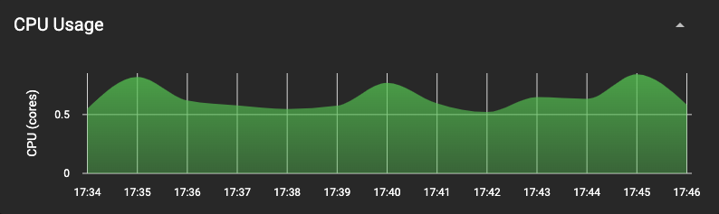
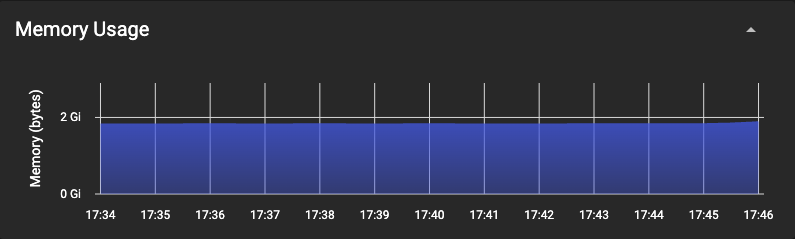

# Submitting Workflows

To submit workflows to your Flyte deployment, only a couple configurations are missing.

When workflows are getting submitted later on, the Flyte binary service needs to be able to resolve the configured hostname `flyte.local`. The most simple way is to add a static host entry to the configmap of coredns.

Install the jq snap for a convenient update of the coredns configmap:
```
sudo snap install jq
```
Set the hostname and ip of your Ubuntu-powered device as bash variables:
```
HOST=flyte.local
IP=your-ubuntu-server-local-ip
```
Update the coredns configmap:
```
kubectl get configmap coredns -n kube-system -o json \
| jq '.data.Corefile += "\n'"$HOST"':53 {\n    errors\n    hosts {\n      '"$IP"' '"$HOST"'\n    }\n}"' | \
kubectl patch configmap coredns -n kube-system --type merge -p "$(cat)"
```

``` bash
kubectl describe configmap coredns -n kube-system
```

Example output:
```bash
Name:         coredns
Namespace:    kube-system
Labels:       addonmanager.kubernetes.io/mode=EnsureExists
              k8s-app=kube-dns
Annotations:  <none>

Data
====
Corefile:
----
.:53 {
    errors
    health {
      lameduck 5s
    }
    ready
    log . {
      class error
    }
    kubernetes cluster.local in-addr.arpa ip6.arpa {
      pods insecure
      fallthrough in-addr.arpa ip6.arpa
    }
    prometheus :9153
    forward . 8.8.8.8 8.8.4.4
    cache 30
    loop
    reload
    loadbalance
}
flyte.local:53 {
    errors
    hosts {
      192.168.178.68 flyte.local
    }
}

BinaryData
====

Events:  <none>
```
> Make sure to restart the coredns deployment after adjusting the configmap.

``` bash
kubectl rollout restart -n kube-system deployment coredns
```

Configure your Flyte config file (located at `$HOME/.flyte/config.yaml`) on your development device in your local network before submitting a workflow:

``` yaml
admin:
  endpoint: dns:///flyte.local
  insecure: false
  caCertFilePath: /path-to-your-exported-self-signed-certificate/flyte.local.cer
```

Download this demo workflow or simply start developing your own:

``` bash
curl -sl https://raw.githubusercontent.com/davidmirror-ops/flyte-the-hard-way/main/docs/on-premises/microk8s/demo.py > demo.py
```

Submit the workflow:
``` bash
pyflyte run --remote demo.py wf
```
Example output:
``` bash
Go to https://flyte.local/console/projects/flytesnacks/domains/development/executions/f63a3e948256f4fd1b81 to see execution in the console.
```
Follow the link and observe your workflow succeeding!
> The first run will take some time due to the download of the flytekit docker image


**Congratulations!**    
You have a fully working Flyte instance running on a local Kubernetes environment only using ~0.5 Cpu Cores & ~2GB of RAM running in idle.


