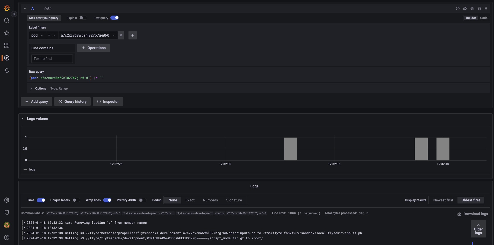

# Adding Flyte Task Logs
This section will demonstrate how to enable and display Flyte task logs on a monitoring system hosted on your Ubuntu-powered device. In the manner of this microk8s guide, we will use the microk8s observability addon. The observability addon is a lightweight stack for logs, traces and metrics and includes deployments for Prometheus, Grafana, Loki & Tempo.

For the scope of just displaying logs, we dont need every single deployment included in the observability addon. To get started, download the adjusted observability-values file from this repo:

``` bash
curl -sl https://raw.githubusercontent.com/davidmirror-ops/flyte-the-hard-way/main/docs/on-premises/microk8s/manifests/observability-values.yaml > observability-values.yaml
```

As shown in the observability-values file we only deploy grafana with loki as an additional data source for now. In addition we also enable ingress for grafana with the hostname `grafana.local`.
> See the full values file for the kube-prometheus-stack [here](https://github.com/prometheus-community/helm-charts/blob/main/charts/kube-prometheus-stack/values.yaml)

Next, enable the observability addon with the adjusted bservability-values file:
``` bash
microk8s enable observability --kube-prometheus-stack-values observability-values.yaml --kube-prometheus-stack-version 55.8.1
```

To access the Grafana UI, extend your local DNS entry on your development device in your local network. In an OSX environment, extend the `/etc/hosts` file:

```bash
127.0.0.1       localhost
255.255.255.255 broadcasthost
::1             localhost
# Add a new entry like this
your-ubuntu-server-local-ip flyte.local grafana.local
```

You should be able to see the Grafana UI visiting the configured hostname `grafana.local`.
> Feel free to repeat the steps in [05-add-ingress-and-tls](05-add-ingress-and-tls.md) to enable TLS for grafana but it is not needed to follow the rest of this turorial 

The last step is about to enable Flyte task logs in the Flyte binary helm chart and to link to the grafana deployment. For this extend the `configuration.logging` object in `edge-values.yaml` like this:
``` yaml
userSettings:
  hostName: flyte.local

configuration:
  logging:
    level: 5
    plugins:
      custom:
        - displayName: Grafana
          templateUris:
            - |
              http://grafana.local/explore?orgId=1&left=%7B%22datasource%22:%22loki%22,%22queries%22:%5B%7B%22refId%22:%22A%22,%22datasource%22:%7B%22type%22:%22loki%22,%22uid%22:%22loki%22%7D,%22editorMode%22:%22builder%22,%22expr%22:%22%7Bpod%3D%5C%22{{ .podName }}%5C%22%7D%20%7C%3D%20%60%60%22,%22queryType%22:%22range%22%7D%5D,%22range%22:%7B%22from%22:%22{{ .podUnixStartTime }}000%22,%22to%22:%22{{ .podUnixFinishTime }}000%22%7D%7D
  database:
  ...
```
Dont forget to update your Flyte deployment and try executing a workflow! You should be able to see the configured Grafana entry on task level.


Finally after clicking the link you should be redirected to your Grafana deployment and see all the logs of your Flyte task. Congratulations!!



