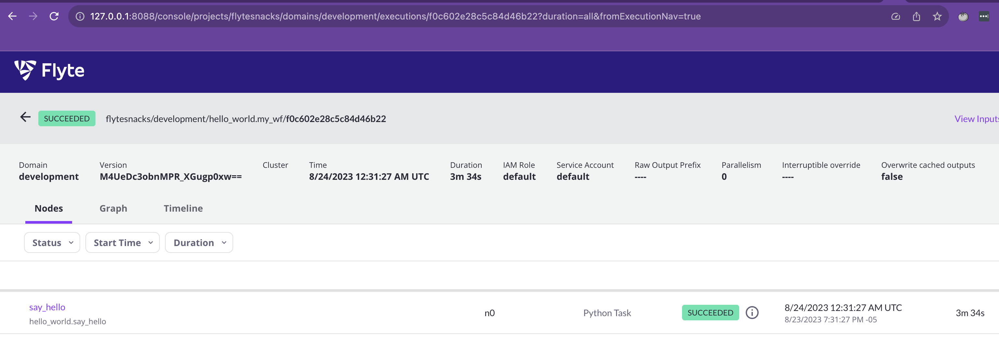

# Configure dependencies and install Flyte

This section assumes that you have a working Kubernetes environment.

The external platform dependencies of Flyte are:

- An S3-compatible object storage used for task metadata and to retrieve data to be processed by workflows.
- A relational database.

In this tutorial, we'll use Minio with a single bucket as the object storage provider and Postgres as the relational database. These two elements are configured to retain data even if the corresponding Pod is deleted.

> NOTE: if you plan to run Flyte on a K8s environment with multiple nodes, the instructions in these section should be generally useful regardless of number of K8s worker and controlplane nodes. Also, to provide shared storage for your environment make sure to check out the supported `minio` [topologies](https://min.io/docs/minio/linux/operations/installation.html) and [supported backend storage systems](https://blog.min.io/best-practices-minio-virtualized/). 

1. Prepare your K8s cluster to provision Persistent Volumes:
```bash
microk8s enable hostpath-storage
```
> NOTE: for other K8s distributions, verify the provisioner available for local storage, typically associated with a StorageClass (`kubectl get storageclass`). If there isn't any, consider using [this implementation](https://github.com/rimusz/hostpath-provisioner) of the hostpath provisioner. To learn more about how Kubernetes handles data persistency, go to [the docs](https://kubernetes.io/docs/concepts/storage/persistent-volumes/).

> PersistentVolumeClaims created by the hostpath storage provisioner are bound to the local node, so **it is impossible to move them to a different node**. For multi-node K8s environments, use the StorageClass surfaced by your shared storage backend.

2. Download the manifest that will deploy the Flyte dependencies:
``` bash
curl -sl https://raw.githubusercontent.com/davidmirror-ops/flyte-the-hard-way/main/docs/on-premises/single-node/manifests/onprem-flyte-dependencies.yaml > onprem-flyte-dependencies.yaml
```
3. Make sure to adjust sensitive values like `MINIO_ROOT_PASSWORD` and `POSTGRES_PASSWORD` before submitting the manifest:
``` bash
kubectl apply -f local-flyte-resources.yaml
```
Example output:
```bash
namespace/flyte created
persistentvolumeclaim/postgresql-pvc created
persistentvolumeclaim/minio-pvc created
service/postgres created
deployment.apps/postgres created
deployment.apps/minio created
service/minio created
```
4. Verify that both `minio` and `postgres` Pods are in `Running` state:
```bash
kubectl get pods -n flyte
```
Example output:
```bash
NAME                        READY   STATUS    RESTARTS   AGE
postgres-6f6bb8bff7-9sjnj   1/1     Running   0          75s
minio-7d795cd5d8-dlk54      1/1     Running   0          75s
```
5.  Add the Flyte Helm repo:
```bash
helm repo add flyteorg https://flyteorg.github.io/flyte
``` 
At this point the dependencies required by Flyte are ready. You can now choose which form factor to deploy:

- Single binary: all [Flyte components](https://docs.flyte.org/en/latest/concepts/architecture.html) (`flyteadmin`,`flytepropeller`, `flyteconsole`, etc) packaged into a single Pod. This is useful for environments with limited resources and a need for quick setup.

- Core: all components as standalone Pods, and potentially different number of replicas. This is required for multi-K8s-cluster environments.

You can only have one of these form factors on a single K8s cluster. 
The following sections guide you through the setup process for each.

## Install single binary

1. In order to avoid saving the DB password in plain text to the `values` file, we leverage a feature of the `flyte-binary` chart that allows to consume pre-created secrets:

- Create an external secret containing the DB password:

```yaml
cat <<EOF >local-secret.yaml      
apiVersion: v1
kind: Secret
metadata:
  name: flyte-binary-inline-config-secret
  namespace: flyte
type: Opaque
stringData:
  202-database-secrets.yaml: |
    database:
      postgres:
        password: "postgres" 
EOF
```
- Submit the manifest:
```bash
kubectl create -f local-secret.yaml
```
- Describe the secret:
```bash
kubectl describe secret flyte-binary-inline-config-secret -n flyte
```
Example output:
```bash
Name:         flyte-binary-inline-config-secret
Namespace:    flyte
Labels:       <none>
Annotations:  <none>

Type:  Opaque

Data
====
202-database-secrets.yaml:  48 bytes
```
2.  Download the values file:
```bash
curl -sL https://raw.githubusercontent.com/davidmirror-ops/flyte-the-hard-way/main/docs/on-premises/single-node/manifests/onprem-flyte-binary/values.yaml > onprem-flyte-binary-values.yaml


3. Install Flyte: 
```bash
helm install flyte-binary flyteorg/flyte-binary  --values onprem-flyte-binary-values.yaml -n flyte
```
Example output:

```bash
NAME: flyte-binary
LAST DEPLOYED: Wed Aug 23 19:12:23 2023
NAMESPACE: flyte
STATUS: deployed
REVISION: 1
TEST SUITE: None
```

4. Verify the `flyte-binary` Pod is in `Running` state:
```bash
kubectl get pods -n flyte
```
Example output:
```bash
NAME                            READY   STATUS    RESTARTS   AGE
postgres-6f6bb8bff7-9sjnj       1/1     Running   0          30m
minio-7d795cd5d8-dlk54          1/1     Running   0          30m
flyte-binary-58d779b9d8-z2hzs   1/1     Running   0          23s
```
Congratulations!     
You have setup Flyte single binary. Now, learn [how to connect to your Flyte instance](#connecting-to-flyte)
## Install Flyte core

> The following configuration requests about 3 CPU cores and 3 GB of memory for the different Flyte components without accounting for workflow executions. 

1. Download the values file
```bash
curl -sL https://raw.githubusercontent.com/davidmirror-ops/flyte-the-hard-way/main/docs/on-premises/single-node/manifests/onprem-flyte-core-values.yaml > onprem-flyte-core-values.yaml
```
2. Review the values file if you need to change anything in the `userSettings` section.
3. Install the `flyte-core` Helm chart:
```bash
helm install flyte-core flyteorg/flyte-core --values onprem-flyte-core-values.yaml -n flyte 
```
Example output
```bash
NAME: flyte-core
LAST DEPLOYED: Fri Mar  8 11:09:10 2024
NAMESPACE: flyte
STATUS: deployed
REVISION: 1
TEST SUITE: None
```
4. Wait for the Pods to come up:
```bash
kubectl get po -n flyte

NAME                                 READY   STATUS    RESTARTS     AGE
postgres-d56745848-7dkhl             1/1     Running   4 (3d ago)   16d
minio-758b9b5d86-s2tnl               1/1     Running   3 (3d ago)   7d21h
syncresources-7cdd9f468c-kzndm       1/1     Running   0            58s
flyteconsole-856d9c594b-qmjv8        1/1     Running   0            58s
datacatalog-bddddcc47-lnmhk          1/1     Running   0            58s
flytepropeller-6dbb9f8cb5-w7wsn      1/1     Running   0            58s
flyte-pod-webhook-867c44bdd4-thrth   1/1     Running   0            58s
flyteadmin-66cb66764d-j7cx2          1/1     Running   0            58s
flytescheduler-579b6cb648-jmmgm      1/1     Running   0            58s
```
## Connecting to Flyte

1. Configure your Flyte config file for local connections (typically located at `$HOME/.flyte/config.yaml`):
> If you haven't done so, install `flytectl` and run `flytectl config init` so the config file is created. Check out the instructions [here](https://docs.flyte.org/en/latest/flytectl_overview.html#installation)

```yaml
admin:
  # For GRPC endpoints you might want to use dns:///flyte.myexample.com
  endpoint: localhost:8089
  authType: Pkce
  insecure: true
logger:
  show-source: true
  level: 6
```
2. Create a local DNS entry so the Flyte CLI connects to the `minio` service using its FQDN:

- In an OSX environment:
```bash
sudo vi /etc/hosts
```
- Add a new entry with the `minio` service name:
```bash
# Host Database
#
# localhost is used to configure the loopback interface
# when the system is booting.  Do not change this entry.
##
127.0.0.1       minio.flyte.svc.cluster.local 
```
3. In three different terminal windows, start three port-forwarding sessions. As each Helm chart uses different Services and ports, the commands are different:

### Single binary
```bash
kubectl -n flyte port-forward service/minio 9000:9000
```
```bash
kubectl -n flyte port-forward service/flyte-binary-grpc 8089:8089
```
```bash
kubectl -n flyte port-forward service/flyte-binary-http 8088:8088
```
### Core
```bash
kubectl -n flyte port-forward service/minio 9000:9000
```
```bash
kubectl -n flyte port-forward service/flyteadmin 8089:81
```
```bash
kubectl -n flyte port-forward service/flyteconsole 8088:80
```
## Using Flyte

4. Save the following "hello world" workflow definition:

```bash
cat <<<EOF >hello_world.py
from flytekit import task, workflow
@task
def say_hello() -> str:
    return "hello world"
@workflow
def my_wf() -> str:
    res = say_hello()
    return res
if __name__ == "__main__":
    print(f"Running my_wf() {my_wf()}")
EOF
```
5. Execute the workflow on the Flyte cluster:
```bash
pyflyte run --remote hello_world.py my_wf
```
Example output:
```bash
Go to http://localhost:8089/console/projects/flytesnacks/domains/development/executions/f0c602e28c5c84d46b22 to see execution in the console.
```
> NOTE: different to what the CLI output indicates, use the `8088` port instead of 8089 to connect to the UI
6. Go to the Flyte console and monitor the execution:


---
**Congratulations!**    
You have a working Flyte instance running on a local Kubernetes environment. Head over to the next sections to productionize your deployment.

