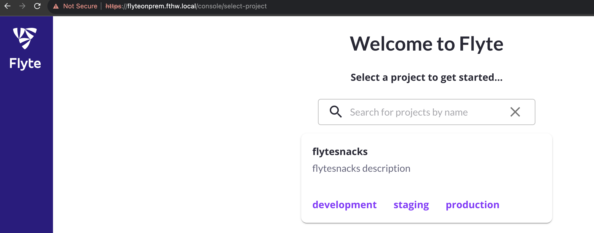
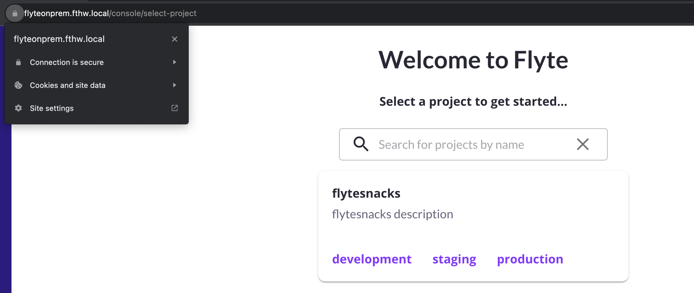

# Add Ingress and Transport Layer Security (TLS)

To avoid the need to open port-forward sessions to connect to the Flyte instance using a single IP/FQDN, this guide will help you add and [Ingress](https://kubernetes.io/docs/concepts/services-networking/ingress/) resource to your deployment. Also, to create a secure communication tunnel between the client and the Flyte instance, you'll configure TLS.

## Add Ingress networking

1. Deploy the NGINX Ingress controller in your K8s node:

```bash
microks enable ingress
```
>NOTE: for other distributions, check out the NGINX [installation instructions](https://docs.nginx.com/nginx-ingress-controller/installation/installing-nic/installation-with-helm/)

>This guide uses NGINX as it supports the annotations that Flyte uses. 

2. Verify the status of the NGINX Ingress controller pod:
```bash
kubectl get pod -n ingress 
```
Example output:
```bash
NAME                                      READY   STATUS    RESTARTS   AGE
nginx-ingress-microk8s-controller-6tdpg   1/1     Running   0          50m
```


3. Add the following block to values file, depending on the Helm chart you installed:

## Single binary
```yaml
ingress:
 create: true
 ingressClassName: nginx
 httpAnnotations:
   nginx.ingress.kubernetes.io/app-root: /console
 grpcAnnotations:
   nginx.ingress.kubernetes.io/backend-protocol: GRPC
 host: flyteonprem.fthw.local #Replace this with the domain name you plan to use to connect to Flyte
```
## Core
```yaml
common:
  ingress:
    create: true
    ingressClassName: nginx
    httpAnnotations:
      nginx.ingress.kubernetes.io/app-root: /console
    grpcAnnotations:
      nginx.ingress.kubernetes.io/backend-protocol: GRPC
    host: flyteonprem.fthw.local #Replace this with the domain name you plan to use to connect to Flyte.
  ```

4. Save your changes.
5. Upgrade the Helm release:

## Single binary
```bash
helm upgrade flyte-binary flyteorg/flyte-binary  --values onprem-flyte-binary-values.yaml -n flyte
```

## Core
 ```bash
helm upgrade flyte-core flyteorg/flyte-core  --values onprem-flyte-core-values.yaml -n flyte
```
6. Verify the status of your Ingress resource:
```bash
kubectl get ingress -n flyte
```
Example output:

## Single binary
```bash
NAME                CLASS   HOSTS                    ADDRESS     PORTS   AGE
flyte-binary-http   nginx   flyteonprem.fthw.local   127.0.0.1   80      168m
flyte-binary-grpc   nginx   flyteonprem.fthw.local   127.0.0.1   80      168m
```
## Core
```bash
NAME                CLASS   HOSTS                    ADDRESS     PORTS   AGE
flyte-core   nginx   flyteonprem.fthw.local   127.0.0.1   80      168m
```

7. Create a new A register for your `HOST` in your DNS server pointing to the IP address of your server. In the absence of a DNS server, edit your local file adding a new entry:

- In an OSX environment:
```bash
sudo vi /etc/hosts
```
- Add a new entry with the `minio` service name:
```bash
# Host Database
##
<your-VM/server-IP>  <your-host-name>
#Example:
#192.168.64.12 flyteonprem.fthw.local 
```
8. Go to `https://<your-host-name>/console` and verify you can access the console:

 

 ## Configuring SSL

For simplicity reasons, this guide uses a self-signed certificate. If your microk8s environment meets the requirements described [here](https://microk8s.io/docs/addon-cert-manager), consider using `cert-manager` to automate the process to generate signed certificates.  
> NOTE: If you already have a valid certificate, skip to step 3.

1. Create environment variables to simplify the cert request process:

``` bash
KEY_FILE=flyte.key
CERT_FILE=flyte.crt
CERT_NAME=flytetls
HOST=flyteonprem.fthw.local #replace with your hostname
```
2. Generate a self-signed certificate:
```bash
openssl req -x509 -nodes -days 365 -newkey rsa:2048 -keyout ${KEY_FILE} -out ${CERT_FILE} -subj "/CN=${HOST}/O=${HOST}" -addext "subjectAltName = DNS:${HOST}"
```
3. Given the certificate and key, create a Kubernetes secret in the `flyte` namespace:
``` bash
kubectl create secret tls ${CERT_NAME} --key ${KEY_FILE} --cert ${CERT_FILE} -n flyte
```
4. Add a `tls` section to the ingress definition in you `values` file:
```yaml
ingress:
  tls:
    enabled: true
    - hosts:
      - "flyteonprem.fthw.local"#replace with your hostname
     secretName: flytetls
  ...
```
5. Upgrade your Helm release
## Single binary
```bash
helm upgrade flyte-binary flyteorg/flyte-binary  --values onprem-flyte-binary-values.yaml -n flyte
```

## Core
 ```bash
helm upgrade flyte-core flyteorg/flyte-core  --values onprem-flyte-core-values.yaml -n flyte
```
6. Verify that your Ingress configuration now includes TLS:

## Single binary
```bash
kubectl  describe ingress flyte-binary-grpc  -n flyte                
```

## Core
```bash
kubectl describe ingress flyte-core  -n flyte                
```

The output should include a line similar to:
```yaml
...
TLS:
  flytetls terminates flyteonprem.fthw.local
  ...
```
7. If you navigate to the console, you'll still see a warning on the certificate. You can export the certificate from the browser and import it into your OS to trust it. 

>On Mac OS simply import the certificate into  KeyChain Access and trust the certificate. This way all browsers on your device can use this trusted certificate.



8. To submit workflows, you'll typically use the CLI, which reads the config in `$HOME/.flyte/config.yaml`. Make sure that the contents of that file include the following:

> NOTE: if you haven't done so, install flytectl so the config file is created

```yaml
admin:
  endpoint: dns:///flyteonprem.fthw.local #change to your hostname
  authType: Pkce
  insecure: false
logger:
  show-source: true
  level: 0
```
9. Download this demo workflow or simply start developing your own:

``` bash
curl -sl https://raw.githubusercontent.com/davidmirror-ops/flyte-the-hard-way/main/docs/on-premises/microk8s/demo.py > demo.py
```

Submit the workflow:
``` bash
pyflyte run --remote demo.py wf
```
Example output:
``` bash
Go to https://flyteonprem.fthw.local/console/projects/flytesnacks/domains/development/executions/f63a3e948256f4fd1b81 to see execution in the console.
```
Follow the link and observe your workflow succeeding!
> The first run will take some time due to the download of the flytekit docker image
---
**Congratulations**

Now you have a working Flyte deployment directly on your machine/node.